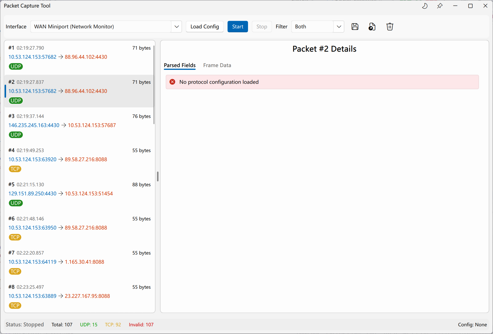
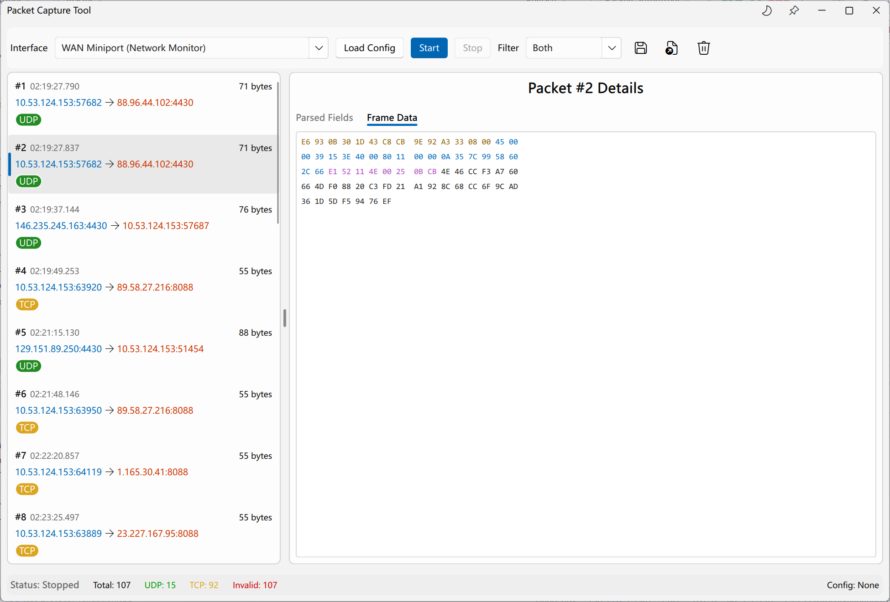
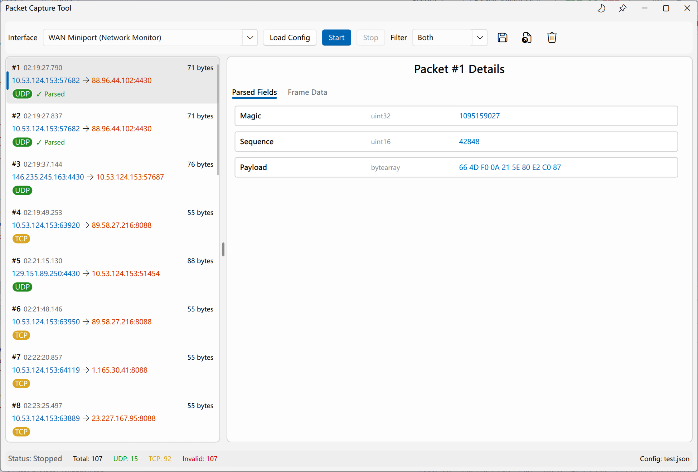
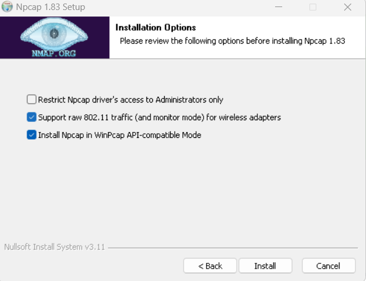

# Packet Capture Tool

一个功能强大的网络数据包捕获与分析工具，专为自定义协议解析而设计。采用 Qt6 QML 构建现代化用户界面，C++ 实现高效后端逻辑，支持实时数据包捕获、离线 PCAP 分析及基于 JSON 配置的多协议解析。

## 软件预览

### 软件界面截图
| 捕获界面 | 报文详情 | 解析视图 |
| :---: | :---: | :---: |
|  |  |  |

## JSON 配置文件说明

本工具通过 JSON 文件定义自定义协议的解析规则。以下是配置字段的详细说明：

### 基本配置
- `protocolName`: 协议名称，用于在界面展示。
- `transportType`: 传输层协议类型，支持 `TCP` 或 `UDP`。
- `port`: 监听端口号。
- `length`: 报文长度定义。
    - `type`: 长度类型，如 `fixed`（固定长度）。
    - `fixedValue`: 固定长度的具体数值（字节）。

### 字段定义 (`fields`)
`fields` 是一个数组，定义了协议中每个字段的解析规则：
- `name`: 字段显示名称。
- `offset`: 该字段在报文中的偏移量（从 0 开始）。
- `length`: 字段所占的字节数。
- `type`: 数据类型，支持：
    - `uint8`, `uint16`, `uint32`, `uint64`: 无符号整数。
    - `int8`, `int16`, `int32`, `int64`: 有符号整数。
    - `string`: 字符串。
    - `bytearray`: 原始字节数组（以十六进制显示）。
- `endianness`: 字节序，支持 `big`（大端）或 `little`（小端）。

### 示例配置 (`docs/test.json`)
```json
{
    "protocolName": "TestProtocol",
    "transportType": "UDP",
    "port": 4430,
    "length": {
        "type": "fixed",
        "fixedValue": 29
    },
    "fields": [
        {
            "name": "Magic",
            "offset": 0,
            "length": 4,
            "type": "uint32",
            "endianness": "big"
        },
        {
            "name": "Sequence",
            "offset": 4,
            "length": 2,
            "type": "uint16",
            "endianness": "big"
        }
    ]
}
```

## 技术栈

- **UI 框架**: Qt 6.4+ (使用 FluentUI 风格组件)
- **后端语言**: C++17
- **抓包库**: PcapPlusPlus (v25.05)
- **构建系统**: CMake (3.16+)
- **测试框架**: Qt Test Framework

## 主要特性

- **实时捕获**: 支持通过 PcapPlusPlus 实时抓取网卡数据包。
- **自定义协议解析**: 通过 JSON 配置文件灵活定义协议字段、偏移量、长度、类型（Int8-64, String, ByteArray）及字节序（大端/小端）。
- **协议过滤**: 支持按传输层协议（UDP/TCP）及端口号进行实时过滤。
- **离线分析**: 支持加载 `.pcap` 文件进行后期分析，或将捕获的报文保存为标准 PCAP 格式。
- **十六进制视图**: 提供报文原始数据的 Hex 视图，方便对照分析。
- **现代化 UI**: 基于 FluentUI 设计，支持深色/浅色模式，提供直观的解析树状视图。

## 项目结构

```text
.
├── 3rdparty/             # 第三方依赖库 (FluentUI, PcapPlusPlus, Npcap SDK)
├── cmake/                # CMake 辅助脚本
├── docs/                 # 项目文档及截图
│   └── screenshots/      # 软件运行截图
├── src/
│   ├── backend/          # C++ 后端核心逻辑
│   │   ├── PacketCaptureEngine  # 数据包捕获引擎
│   │   ├── FilterEngine         # 过滤与匹配逻辑
│   │   ├── ProtocolParser       # 自定义协议解析器
│   │   ├── ConfigurationLoader  # 协议配置加载 (JSON)
│   │   ├── CaptureController    # UI 与后端的桥接层
│   │   └── PacketModel          # QML 列表模型
│   └── ui/               # QML 前端界面
│       └── MainWindow.qml      # 主界面
├── tests/                # 自动化单元测试 (协议验证、配置加载等)
└── CMakeLists.txt        # 项目主构建文件
```

## 快速开始

### 依赖环境

- **Qt 6.4+**: 确保已安装 `Core`, `Gui`, `Qml`, `Quick`, `QuickControls2`, `QuickDialogs2` 模块。
- **Npcap (Windows)**:
  - 需要安装 [Npcap 驱动](https://npcap.com/#download) 并在安装时勾选 "Install Npcap in WinPcap API-compatible Mode"。
  - 
- **PcapPlusPlus**: 项目已内置相关依赖，通常无需额外安装。

### 构建与运行

```bash
# 克隆仓库
git clone https://github.com/RookieLinux/PacketCaptureTool
cd PacketCaptureTool

# 使用 CMake 配置并构建，注意更改路径为实际编译使用的Qt路径
cmake -B build -DCMAKE_BUILD_TYPE=Release -DCMAKE_PREFIX_PATH=D:\Qt\Qt6.6.2\6.6.2\mingw_64
cmake --build build --config Release

# 运行程序
./build/Release/PacketCaptureTool.exe
```

## 使用指南

1. **加载配置**: 点击 "Load Config" 按钮，选择您的协议定义 `.json` 文件。
2. **选择网卡**: 在下拉框中选择正确的网络接口。
3. **开始抓包**: 点击 "Start" 按钮开始捕获。
4. **报文分析**:
   - 在列表中点击任意报文。
   - 右侧面板将自动展示根据配置解析出的字段信息。
   - 底部面板展示对应的十六进制原始数据。
5. **保存/加载**: 使用菜单栏功能将报文保存为 PCAP 或加载现有的 PCAP 文件。

## 单元测试

项目包含完善的单元测试（位于 `tests/` 目录）：
```bash
cd build
ctest --output-on-failure
```

## 架构设计

系统遵循 **MVVM (Model-View-ViewModel)** 模式：
- **View (QML)**: 响应式 UI，负责交互与数据展示。
- **ViewModel (CaptureController)**: 业务逻辑核心，管理抓包状态与协议解析流程。
- **Model**: `PacketModel` 提供数据支撑，底层 `Engine` 负责高性能捕获。

## 许可证

[MIT License](LICENSE)

